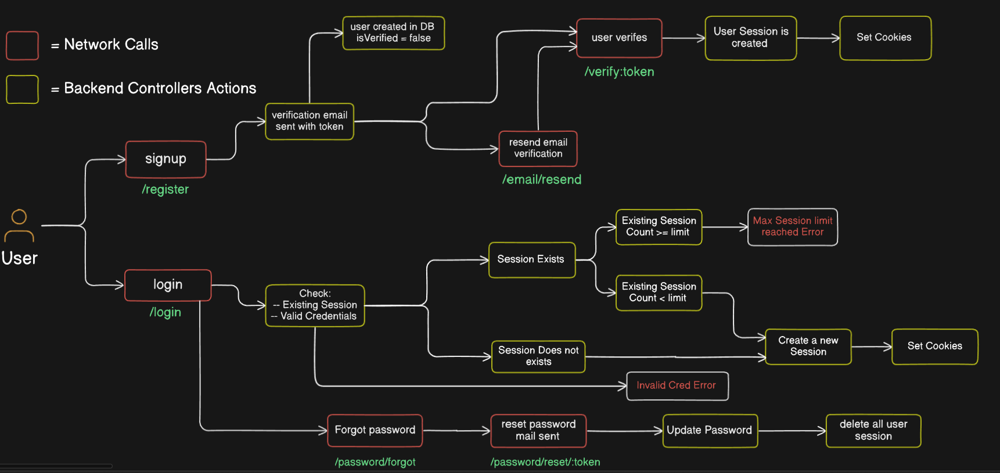
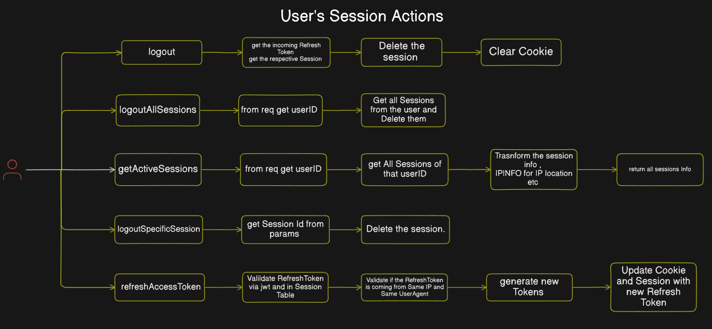
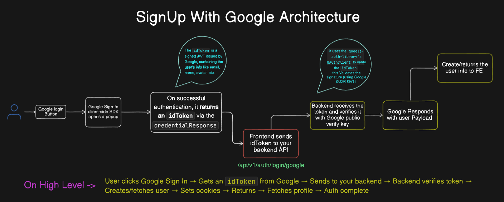

# AuthFLow

# User Session Management

# Google Authentication Workflow

Some Important Questions: 

1. Why you check IP and User-Agent in refreshAccessToken:

You're doing this to prevent token theft + reuse from another device.

Pros:
- Strong protection against attackers who steal refresh tokens (via XSS, DB leak, etc.)
- Makes sure token is only valid from original device/network

Cons:
- On mobile networks, IP can change frequently
- VPN users may get false rejections
- Can lead to unexpected logouts

Checking both user-agent and IP adds an extra security layer to detect token misuse. However, IP addresses can change (mobile/VPN), so it’s a tradeoff between security and user experience. A better approach might be:
- Use only user-agent, which is more stable
- Or, allow IP mismatch but log it or trigger extra verification (like alert email)
- You could also store a lastKnownIp for future pattern checks instead of hard enforcing it

2. forgotPassword controller does not reveal whether the email exists in the system. Why is this a good practice?
- In the forgotPassword controller, I intentionally return a generic success message even if the email doesn't exist.This prevents user enumeration attacks, where an attacker could brute-force the endpoint with a list of emails to find out which ones are valid in the system.
Once attackers know an email exists:
They can attempt credential stuffing
Send phishing emails. Or even plan targeted account takeovers. So by always returning the same response — “If an account exists, a reset link has been sent” — I keep my system behavior consistent and secure.